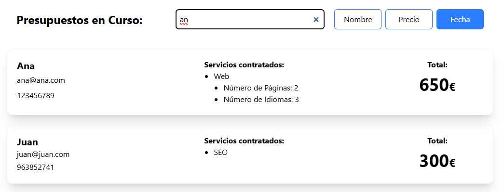
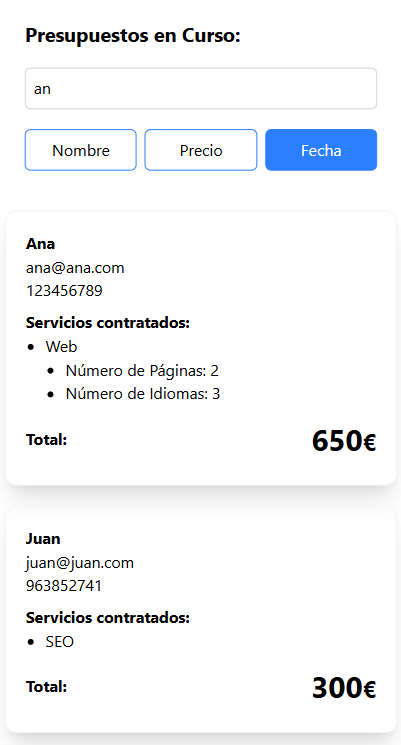
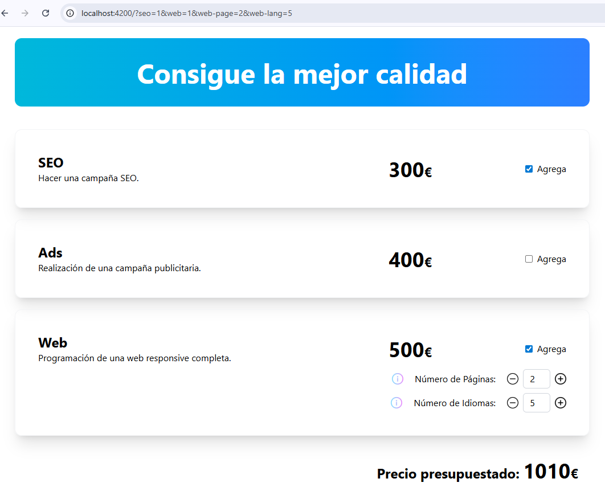

# IT-S6-Angular-Budgets

## 🗂️Tabla de contenidos

- [IT-S6-Angular-Budgets](#it-s6-angular-budgets)
  - [🗂️Tabla de contenidos](#️tabla-de-contenidos)
  - [📄Descripción](#descripción)
    - [1. Creación del formulario](#1-creación-del-formulario)
    - [2. Añadir páginas e idiomas](#2-añadir-páginas-e-idiomas)
    - [3. Mostrar ventana de información](#3-mostrar-ventana-de-información)
    - [4. Testing](#4-testing)
    - [5. Lista de presupuestos](#5-lista-de-presupuestos)
    - [6. Ordenar presupuestos](#6-ordenar-presupuestos)
    - [7. Filtrar presupuestos](#7-filtrar-presupuestos)
    - [8. Cargar datos desde url](#8-cargar-datos-desde-url)
  - [💻Tecnologías Utilizadas](#tecnologías-utilizadas)
  - [📋Requisitos](#requisitos)
  - [🛠️Instalación](#️instalación)
    - [1. Descargar el repositorio](#1-descargar-el-repositorio)
    - [2. Instalación de paquetes Node.js](#2-instalación-de-paquetes-nodejs)
  - [▶️Ejecución](#️ejecución)
    - [Testing](#testing)
  - [📸 Demo](#-demo)

## 📄Descripción

Página web para generar presupuestos de desarrollo. Permite guardar los presupuestos con los datos del cliente, ordenarlos y filtrarlos.

### 1. Creación del formulario

- Maquetar web inicial.
- Crear un formulario con tres bloques: SEO, Ads y Web.
- Al hacer activar los checks, se suman los precios al total del presupuesto.

### 2. Añadir páginas e idiomas

- En el elemento Web, añadir el número de páginas y de idiomas.
- Añadir botones para subir y bajar los valores de páginas e idiomas.
- Calcular el presupuesto con los elementos nuevos.
- Separar en componentes: budget, product y panel.
- Implementar signal para gestionar cambios.
- Mover cálculos a servicio.
- Mover datos a archivo de datos.


### 3. Mostrar ventana de información

- Crear ventana modal que muestre título y descripción.
- Añadir botones de info al panel.
- Abrir aviso al hacer clic en info.
- Cerrar la ventana.
- Cargar datos del panel a la ventana modal.


### 4. Testing

- Tests del servicio `budget-products`
  - `productAmount()`
  - `productListAmount()`
- Tests del componente `budget`
- Tests del componente `product`


### 5. Lista de presupuestos

- Añadir formulario con datos de cliente.
- Validar formulario.
- Guardar presupuesto en servicio.
- Mostrar lista de presupuestos.
- Formatear componentes.

<div style="display: flex; flex-wrap: wrap; gap: 20px; align-items: flex-start; margin-top: 1rem;">
  
  
</div>


<div style="display: flex; flex-wrap: wrap; gap: 20px; align-items: flex-start; margin-top: 1rem; margin-bottom: 1rem">
  
  
</div>

### 6. Ordenar presupuestos

- Hacer funciones de ordenación en el servicio.
  - `orderBudgetsByName()`.
  - `orderBudgetsByTotal()`.
  - `orderBudgetsByDate()`.
- Añadir botones de ordenación y darle estilos.
- Cambiar botones por input radio.


### 7. Filtrar presupuestos

- Añadir formulario de búsqueda.
- Función de búsqueda en servicio.
- Copia de estructura de datos para evitar modificaciones.
- Eventos y computación con signals.
- Mejora en la visualización móvil.

<div style="display: flex; flex-wrap: wrap; gap: 20px; align-items: flex-start; margin-top: 1rem;">
  
  
</div>

### 8. Cargar datos desde url

- Añadir parámetros en la ruta al modificar el presupuesto.
- Leer la ruta actual y cargar los parámetros en el presupuesto.



## 💻Tecnologías Utilizadas

- HTML
- Tailwind
- Typescript
- Angular
- Eslint
- Karma / Jasmine

## 📋Requisitos

- Navegador web
- Node.js
  
## 🛠️Instalación

### 1. Descargar el repositorio

```shell
git clone https://github.com/soyjuandelgado/IT-S6-Angular-Budgets.git destino
```

### 2. Instalación de paquetes Node.js

```shell
npm install
```

## ▶️Ejecución

```shell
ng serve -o
```

### Testing

```shell
ng test
```

## 📸 Demo

Visitar la web: [Web](https://it-s6-angular-budgets-git-develop-juans-projects-c1221148.vercel.app/)
